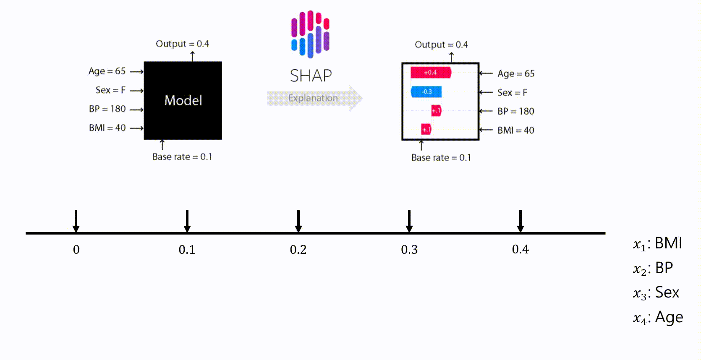

# MLOps-course
MLOps Specialize: Udemy Bootcamp 2022 

## Section 12: Model Interpretability

SHAP (SHapley Additive exPlanations): Một cách tiếp cận sử dụng lý thuyết trò chơi nhằm giải thích đầu ra của mô hình học máy.Hỗ trợ minh họa và trực quan các giá trị trong mô hình học máy một cách dễ hiểu.
- https://shap.readthedocs.io/en/latest/
- https://github.com/shap/shap

Ứng dụng: 
- Feature Selection (trích chọn đặc trưng)
- Debug mô hình:SHAP cho phép các nhà phát triển xác định và sửa chữa vấn đề trong các mô hình học máy bằng cách chỉ ra những đặc trưng nào gây ra những dự đoán sai lệch.
- Đánh giá tính công bằng (Fairness Assessment): SHAP có thể được sử dụng để đánh giá tính công bằng của một mô hình, xác định những đặc trưng nào góp phần vào sự chênh lệch trong kết quả giữa các nhóm nhân khẩu khác nhau.

Đọc thêm: https://freedium.cfd/https://python.plainenglish.io/shapley-additive-explanations-unveiling-the-black-box-of-machine-learning-477ba01ffa07