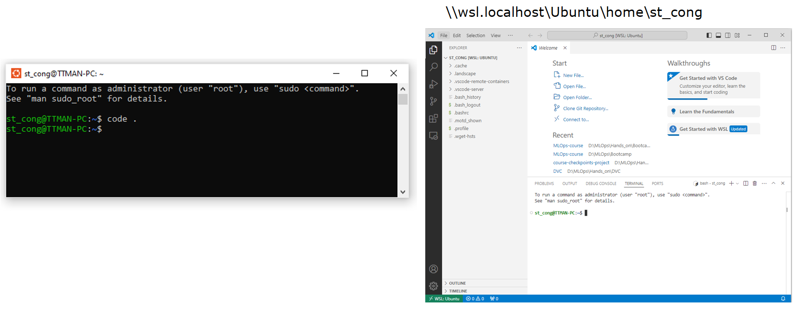
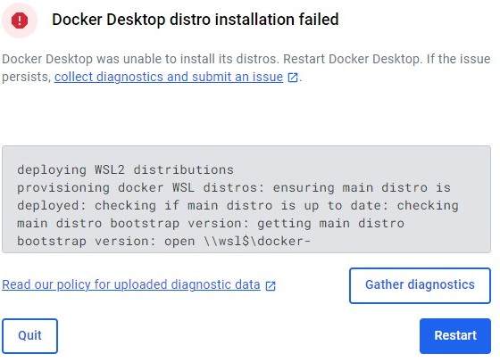
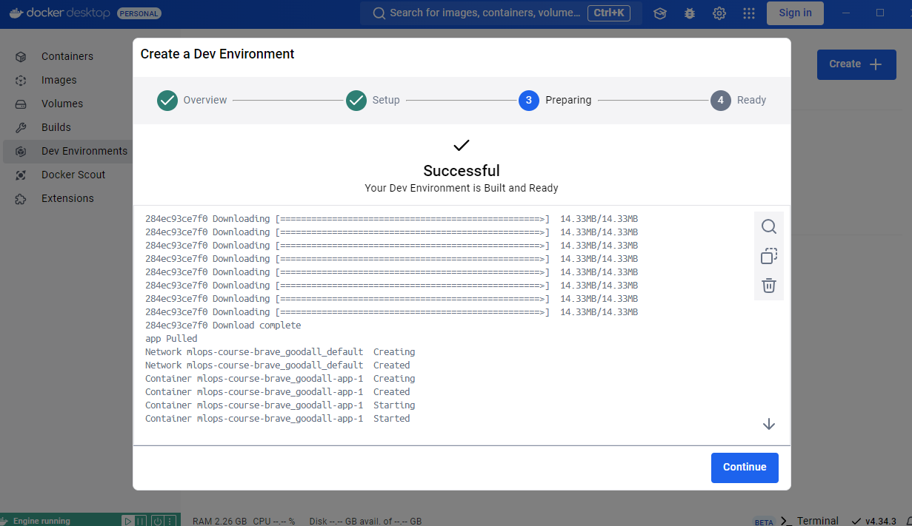

# MLOps-course
MLOps Specialize: Udemy Bootcamp 2022 

## 1. Khởi chạy môi trường phát triển Linux trên Window

`window user only`

### Option 1: Sử dụng VSCode trong môi trường Ubuntu
Cài đặt WSL & Ubuntu
- [Manual installation steps for older versions of WSL](https://learn.microsoft.com/en-us/windows/wsl/install-manual#step-4---download-the-linux-kernel-update-package)

Sau khi cài đặt môi trường và thiết lập xong, có thể sử dụng vscode 



### Option 2: Sử dụng VSCode trong môi trường Docker

**Bước 1**: Cài đặt Docker, Docker Desktop cho Window
- [How to Create a Great Local Python Development Environment with Docker](https://www.youtube.com/watch?v=6OxqiEeCvMI)
- [How to Run and Debug Python Inside Docker Containers Using VSCode](https://www.youtube.com/watch?v=cJbvcH0JNGA)
- [Python Environment - venv & Docker (locally and GitHub)](https://www.youtube.com/watch?v=wSombq0VV5w)

<details>
<summary>⚠️ Docker issues: Cannot start Linux container on Window</summary>

- [Docker forever in "Docker is starting.." at Windows task](https://forums.docker.com/t/docker-stuck-on-starting/125351/4)
- [Docker Desktop distro installation failed](https://github.com/docker/for-win/issues/14183)



```bash
dism.exe /online /enable-feature /featurename:Microsoft-Windows-Subsystem-Linux /all /norestart
wsl --set-default-version 2
wsl --unregister docker-desktop
```
</details>

**Bước 2:** Mở Docker và thiết lập Dev Environment

Chọn thư mục làm việc để tạo môi trường, có thể import từ github hoặc thư mục local



## Conda Env

Khởi tạo môi trường conda và lưu ở đường dẫn xác định
- [Conda-Specifying a location for an environment](https://docs.conda.io/projects/conda/en/latest/user-guide/tasks/manage-environments.html#specifying-a-location-for-an-environment)
- [Easily move a conda environment to a different drive on Windows without touching with conda](https://gist.github.com/mattirish/4c04c0a64654760c0c3ff040b07ff181)


```bash
conda create --prefix D:/Users/st_cong/conda/mlops python=3.9
```

> create: error: argument -n/--name: not allowed with argument -p/--prefix

```bash
# To activate this environment, use
#
#     $ conda activate D:\Users\st_cong\conda\mlops
#
# To deactivate an active environment, use
#
#     $ conda deactivate
```

Tạo simlink để rút gọn tên môi trường
```bash
mklink /J "C:\Users\st_cong\AppData\Local\miniconda3\envs\mlops" "D:\Users\st_cong\conda\mlops" 
```
Sau khi tạo sim-link có thể gọi thẳng tên môi trường thay vì full path như cũ

```
conda activate mlops
```


## Cookiecutter
```bash
pip install cookiecutter
cookiecutter https://github.com/khuyentran1401/data-science-template
```


## Poetry

[Setup Conda with Poetry](https://freedium.cfd/https://medium.com/m/global-identity-2?redirectUrl=https%3A%2F%2Fblog.stackademic.com%2Fconda-and-poetry-a-harmonious-fusion-8116895b6380)

```bash
conda install poetry
# conda install -c conda-forge poetry
```

Init

Khởi tạo poetry tại thư mục hiện tại
```bash
poetry init
```


Tạo thư mục dự án mới với poetry
```bash
poetry new test-poetry
```


Thêm package mới vào poetry
```bash
# poetry add <package_name>
poetry add numpy pandas matplotlib
```

Remove library
```bash
# poetry remove <package_name>
poetry remove pandas
```

Lock the dependencies to ensure reproducibility:
```bash
poetry lock
```

When need to reinstall
```bash
poetry install
```


## Makefile

https://quantrimang.com/cong-nghe/huong-dan-sua-loi-notrecognized-as-an-internal-or-external-command-125877

Makefile creates short and readable commands for configuration tasks. You can use Makefile to automate tasks such as setting up the environment.

## Makefile

https://quantrimang.com/cong-nghe/huong-dan-sua-loi-notrecognized-as-an-internal-or-external-command-125877

Makefile creates short and readable commands for configuration tasks. You can use Makefile to automate tasks such as setting up the environment.

```bash
sudo apt install make
make hello
```

