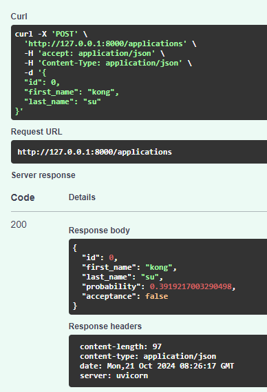

# MLOps-course
MLOps Specialize: Udemy Bootcamp 2022 


## Section 13: Putting models into production
There are different alternatives to deploy a model in a production environment:
 1. Through API 
 2. Through applications (mobile/web)

## Section 14: MLOps phase 3: Model serving through APIs
Several Python API package for quickstart:
- [FastAPI](https://fastapi.tiangolo.com/tutorial/first-steps/)
- [Flask](https://flask.palletsprojects.com/en/3.0.x/quickstart/)
- [Django](https://www.django-rest-framework.org/tutorial/quickstart/)

In this Section we focus on serving model via APIs using FastAPI framework

### 1. Run first simple FastAPI app
1. Create new conda env
```bash
conda create --name phase3-mlops python=3.9
# or
# conda create --prefix D:/Users/st_cong/conda/phase3-mlops python=3.9
# mklink /J "C:\Users\st_cong\AppData\Local\miniconda3\envs\phase3-mlops" "D:\Users\st_cong\conda\phase3-mlops" 
conda activate phase3-mlops
```
2. Install packages
```bash
(phase3-mlops) pip install -r requirements.txt
```
3. Run App
```bash
(phase3-mlops) python "1.FastAPI Fundamentals.py"

INFO:     Started server process [8372]
INFO:     Waiting for application startup.
INFO:     Application startup complete.
INFO:     Uvicorn running on http://127.0.0.1:8000 (Press CTRL+C to quit)
```
> You can open direct http://127.0.0.1:8000 to send request to API or make request via [PostMan](https://www.postman.com/)

4. API specs via Swagger OpenAPI:

Interactive API [exploration](http://localhost:8000/docs) and [documentation](http://localhost:8000/redoc) are automatically generated

5. Try Post METHOD with Pydantic:
```bash
(phase3-mlops) python "2. FastAPI_postmethodPydantic.py"
```


### 2. FastAPI with Scikit-learn model
Change dir to 3_API_for_Scikit-learn_Model and install required packages:
```bash
(phase3-mlops) 
cd 3_API_for_Scikit-learn_Model
pip install -r requirements.txt
```
Run APIs App:
```bash
(phase3-mlops) python app.py
```

**Pipeline**:
- Init and Load scikit-learn model via `Model.py`
- Call loaded IrisModel in `app.py` 
- Predict new sample with endpoint `/predict`

You can write test script in `test.py` to check inference of your model, Open new terminal and run:
```bash
(phase3-mlops) python test.py
# b'{"prediction":"virginica","probability":0.88}'
```

### 3. Generate API from Pycaret pipeline 
Change dir to 4_API_from_Pycaret_pipeline and install required packages:
```bash
(phase3-mlops) 
cd 4_API_from_Pycaret_pipeline
pip install -r requirements.txt
```

Run APIs App:
```bash
(phase3-mlops) python pycaret_app.py

# Transformation Pipeline and Model Successfully Loaded
# INFO:     Started server process [14924]  
# INFO:     Waiting for application startup.
# INFO:     Application startup complete.   
# INFO:     Uvicorn running on http://127.0.0.1:8000 (Press CTRL+C to quit)
```


Pycaret also support generate APIs for skitlearn model:
```python
# create API
create_api(lightgbm, 'my_first_api')
'''
This will automate generate APIs:
- my_first_api.pkl (sklearn model pipeline)
- my_first_api.py  (FastAPI python script)
'''
```
> See [this notebook](4_API_from_Pycaret_pipeline/API%20with%20Pycaret%20and%20FastAPI.ipynb) for more details