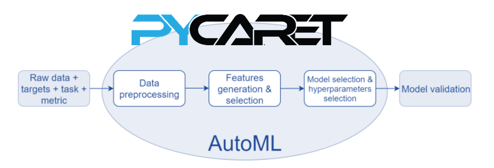
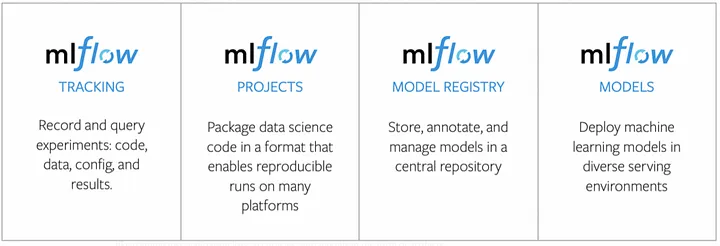

# MLOps-course
MLOps Specialize: Udemy Bootcamp 2022 

# PHASE 2: Automate the ML Model Cycle

### 1. [Pycaret](/Pycaret/) - AutoML

### 2. [MLFlow](/MLFlow/) - Tracking experiment, Registry Artifact
