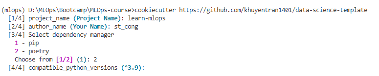
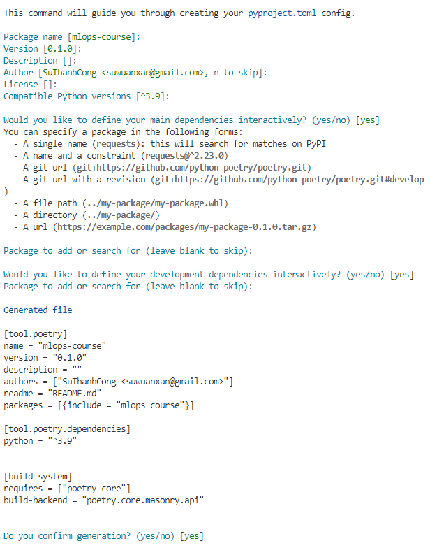

# MLOps-course
MLOps Specialize: Udemy Bootcamp 2022 


```bash
conda create --prefix D:/Users/st_cong/conda/mlops python=3.9
```

> create: error: argument -n/--name: not allowed with argument -p/--prefix

```bash
# To activate this environment, use
#
#     $ conda activate D:\Users\st_cong\conda\mlops
#
# To deactivate an active environment, use
#
#     $ conda deactivate
```

Tạo simlink để rút gọn tên môi trường
```bash
mklink /J "C:\Users\st_cong\AppData\Local\miniconda3\envs\mlops" "D:\Users\st_cong\conda\mlops" 
```
Sau khi tạo sim-link có thể gọi thẳng tên môi trường thay vì full path như cũ

```
conda activate mlops
```


Cookiecutter
```bash
pip install cookiecutter
cookiecutter https://github.com/khuyentran1401/data-science-template
```




## Poetry

[Setup Conda with Poetry](https://freedium.cfd/https://medium.com/m/global-identity-2?redirectUrl=https%3A%2F%2Fblog.stackademic.com%2Fconda-and-poetry-a-harmonious-fusion-8116895b6380
)

```bash
conda install poetry
# conda install -c conda-forge poetry
```

Init

Khởi tạo poetry tại thư mục hiện tại
```bash
poetry init
```



Tạo thư mục dự án mới với poetry
```bash
poetry new test-poetry
```